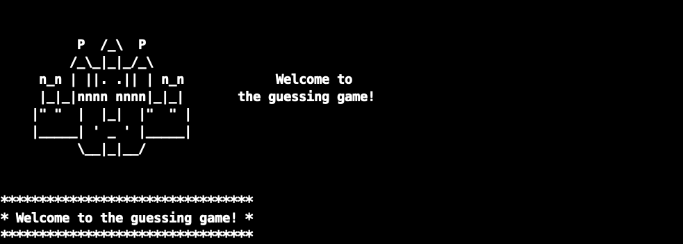
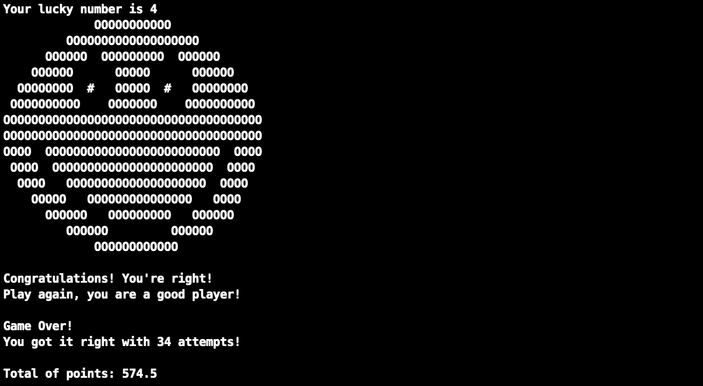
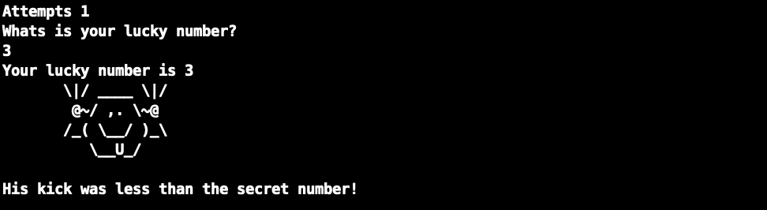

# ✨ Jogo Forca

<h1 align="center">
  
</h1>

### ALURA 🚀  C I - Introdução à Linguagem das Linguagens

- ### 💻 C
    - 01-Compilador GCC
    - 02-Escopo
    - 03-Variaveis 
    - 04-Condicionais
    - 05-Loops
    - 06-Ascii Art

- ### 🖥 Rodar o Jogo
    - 01-Clone

            git clone https://github.com/wwwillian/Jogo_C_Forca.git

    - 02-Entre na pasta

            cd Jogo_C_Forca

    - 03-Rode o comando para compilar o arquivo em C

            gcc guessing.c -o guessing.out 

    - 04-Rode o jogo

            ./guessing.out 

- ### 🕹 Jogar o jogo
    - Informe um número e aperte "Enter"

<h1 align="center">

  
     
    
  
</h1>

### 📝 Licença
Esse projeto está sob a licença MIT. Veja o arquivo LICENSE para mais detalhes.
